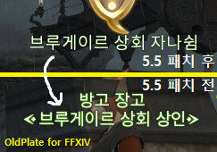

# OldPlate

- OldPlate는 파이널 판타지 14의 이름 글꼴을 예전으로 돌려주는 프로그램입니다.

- 이 프로그램의 사용으로 인한 모든 피해는 사용자에게 있고, 제작자는 그 어떤 책임도 지지 않습니다.

- 이 프로그램은 [Affero General Public License v3](/LICENSE) 하에 배포됩니다

## [LICENSE](/LICENSE)

## 요구 사항

- Windows 10 환경에서 실행하는 DX11 클라언트.

## 사용방법

1. [여기](https://github.com/RyuaNerin/OldPlate/releases/latest) 에서 마지막 릴리즈를 **적당한 위치** 에 다운로드 해주세요.

1. `OldPlate.exe` 를 실행해주세요.

1. 해제를 원하시면 `OldPlate.exe` 를 다시 실행해주세요.
